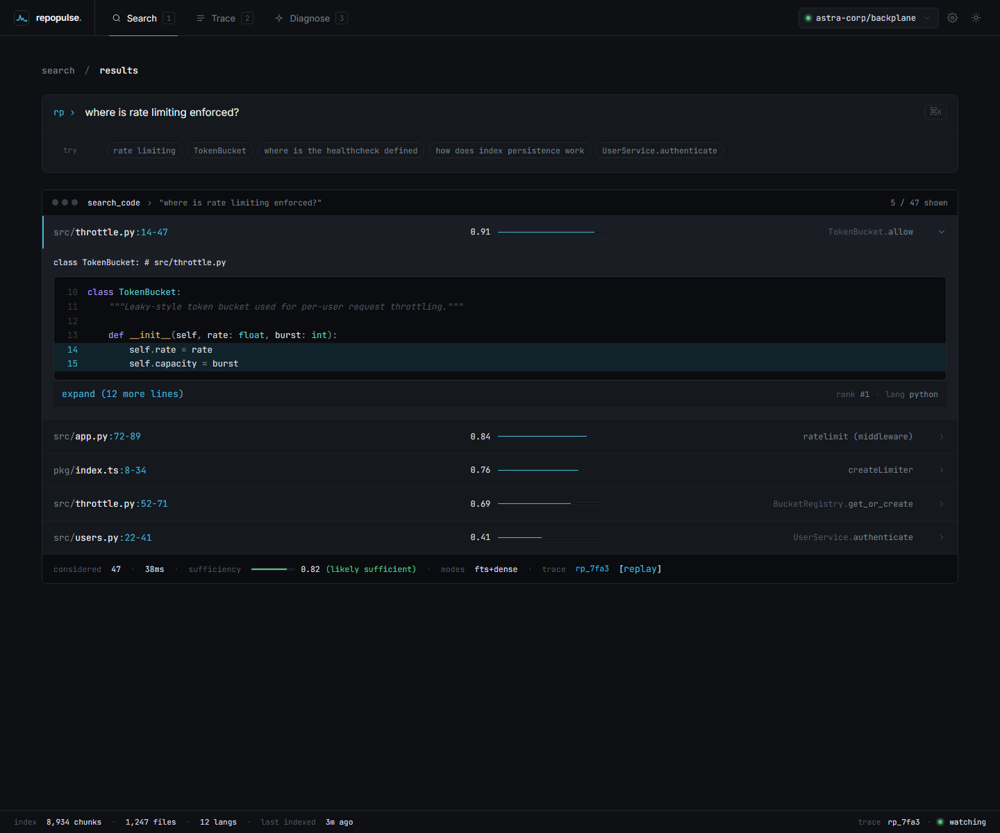
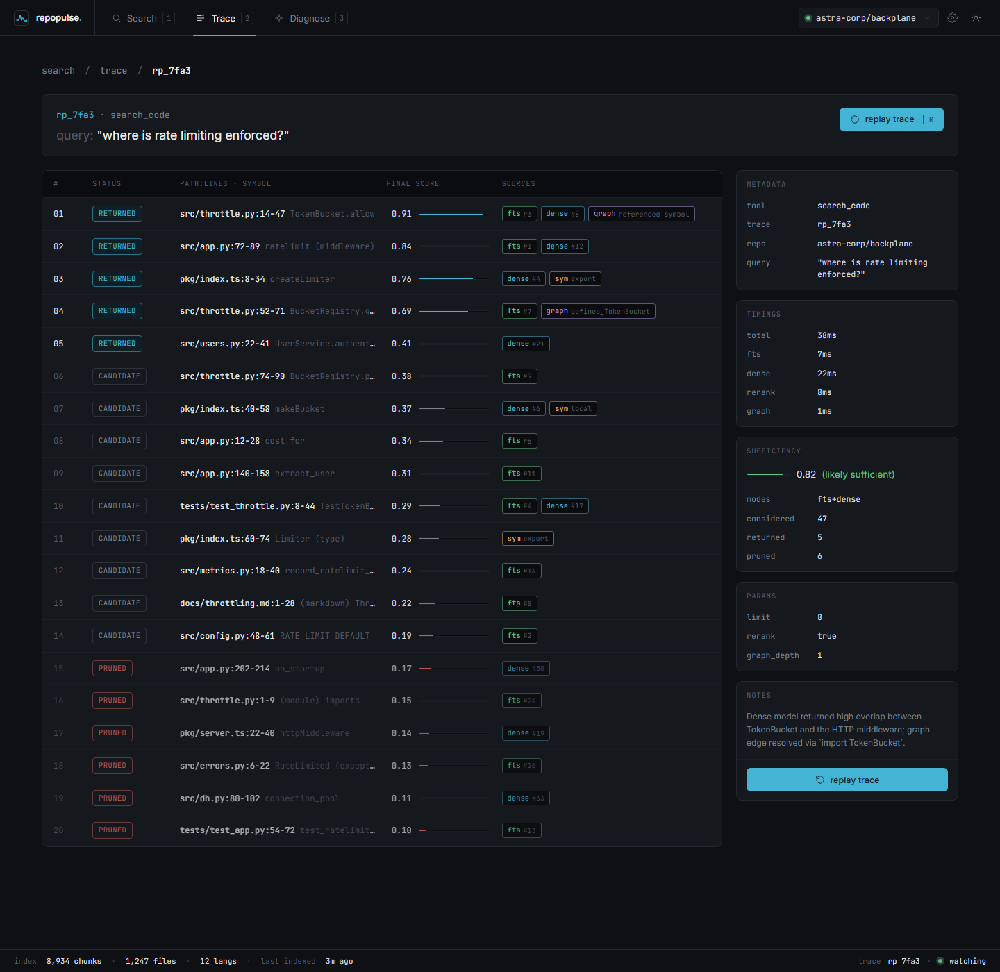

# RepoPulse MCP

Local-first code retrieval for coding agents, with a replayable trace of every retrieval.

RepoPulse indexes a repository into `.repopulse/index.db`, serves that index over MCP, and records what retrieval considered, what it returned, and how strong the result looked. When an agent misses the right file, you can inspect the trace instead of guessing whether the model hallucinated or retrieval failed.



## What It Ships Today

- Local indexing with tree-sitter-aware chunking, symbol extraction, reference extraction, SQLite storage, and FTS5 search.
- Optional local dense reranking with `fastembed` plus `sqlite-vec`.
- A stdio MCP server with 12 tools.
- CLI commands for `index`, `search`, `trace`, `doctor`, `bad`, `bad-list`, `serve`, and `install`.
- Replayable traces for `search_code`, `find_symbol`, `find_references`, and `read_file`.
- Default safety rails: relative-path reads only, repo-bound traversal checks, secret-looking files skipped from indexing, and secret-looking reads blocked.

## Install

RepoPulse is not published to PyPI yet. Install from this repo or from GitHub.

From GitHub:

```bash
pipx install git+https://github.com/evilander/repopulse-mcp.git
# or
uv tool install git+https://github.com/evilander/repopulse-mcp.git
```

From a local clone:

```bash
git clone https://github.com/evilander/repopulse-mcp.git
cd repopulse-mcp
uv venv .venv --python 3.11
. .venv/Scripts/activate
uv pip install -e ".[dev]"
```

With embeddings:

```bash
pipx install 'git+https://github.com/evilander/repopulse-mcp.git#egg=repopulse-mcp[embeddings]'
```

## Quick Start

Index a repo:

```bash
cd /path/to/your/repo
repopulse index
```

Search it:

```bash
repopulse search "where is rate limiting enforced?"
```

Replay the trace:

```bash
repopulse trace rp_1234abcd
```

Wire it into local MCP clients:

```bash
repopulse install
```

Manual client snippets live in [docs/MCP_CLIENTS.md](docs/MCP_CLIENTS.md).

## Configuration

RepoPulse reads `<repo>/.repopulse/config.toml` if present, then applies environment overrides.

Example:

```toml
[indexer]
max_file_bytes = 2000000
extra_excludes = ["vendor/", "generated/"]

[embeddings]
enabled = true
model_name = "BAAI/bge-small-en-v1.5"

[retrieval]
default_limit = 10
candidate_limit = 500
rrf_k = 60
graph_neighbor_weight = 0.5
```

Supported environment overrides include:

- `REPOPULSE_EMBEDDINGS`
- `REPOPULSE_EMBEDDINGS_MODEL`
- `REPOPULSE_EMBEDDINGS_BATCH_SIZE`
- `REPOPULSE_MAX_FILE_BYTES`
- `REPOPULSE_MAX_CHUNK_BYTES`
- `REPOPULSE_MIN_CHUNK_BYTES`
- `REPOPULSE_EXTRA_EXCLUDES`
- `REPOPULSE_RESPECT_GITIGNORE`
- `REPOPULSE_DEFAULT_LIMIT`
- `REPOPULSE_CANDIDATE_LIMIT`
- `REPOPULSE_RRF_K`
- `REPOPULSE_GRAPH_EXPAND_HOPS`
- `REPOPULSE_GRAPH_NEIGHBOR_WEIGHT`

## MCP Tools

| Tool | Purpose |
|---|---|
| `index_repo` | Build or refresh the index. |
| `search_code` | Hybrid retrieval with a replayable `trace_id`. |
| `find_symbol` | Exact, prefix, or fuzzy symbol lookup. |
| `find_references` | Import and call references for a symbol name. |
| `read_file` | Bounded read of a repo-relative file. |
| `get_context_trace` | Replay the stored trace for a retrieval. |
| `explain_last_result` | Fetch the most recent trace quickly. |
| `diagnose_missing_context` | Suggest likely gaps after a bad or weak retrieval. |
| `get_index_health` | Counts, languages, staleness, and recent traces. |
| `mark_bad_trace` | Flag a trace that led to a bad agent action. |
| `list_bad_traces` | Review recent flagged traces. |
| `list_indexed_files` | Show the newest indexed files. |

## Safety Model

- Repo paths must stay inside the indexed root. Absolute paths and `../` escapes are rejected.
- Secret-looking files are skipped during indexing when the leading content matches private-key or secret-assignment patterns.
- `read_file` refuses to serve secret-looking file contents even if the file exists in the repo.
- Trace queries and feedback reasons are size-capped, and the trace table is retained to a fixed rolling window.
- Everything runs locally. There is no network dependency unless you opt into installing dependencies from the internet.

## Status

Current validation on this checkout:

- `pytest -q`: 74 passed, 1 skipped
- `ruff check src tests`: passed
- `mypy src`: passed



## Troubleshooting

See [docs/TROUBLESHOOTING.md](docs/TROUBLESHOOTING.md).

## Development

```bash
uv venv .venv --python 3.11
. .venv/Scripts/activate
uv pip install -e ".[dev]"
python -m pytest -q
python -m ruff check src tests
python -m mypy src
```

## More Context

- [docs/ARCHITECTURE.md](docs/ARCHITECTURE.md)
- [docs/MCP_CLIENTS.md](docs/MCP_CLIENTS.md)
- [MANIFESTO.md](MANIFESTO.md)
- [codex.md](codex.md)

## License

MIT.
